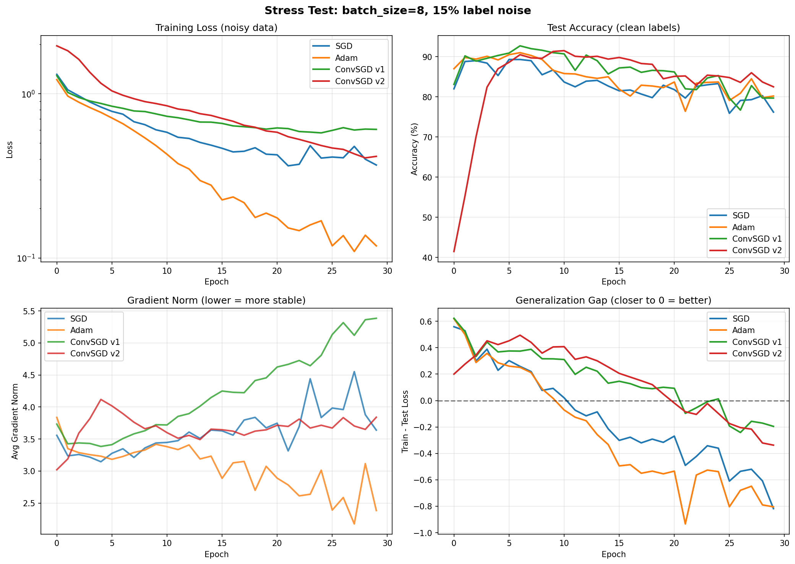
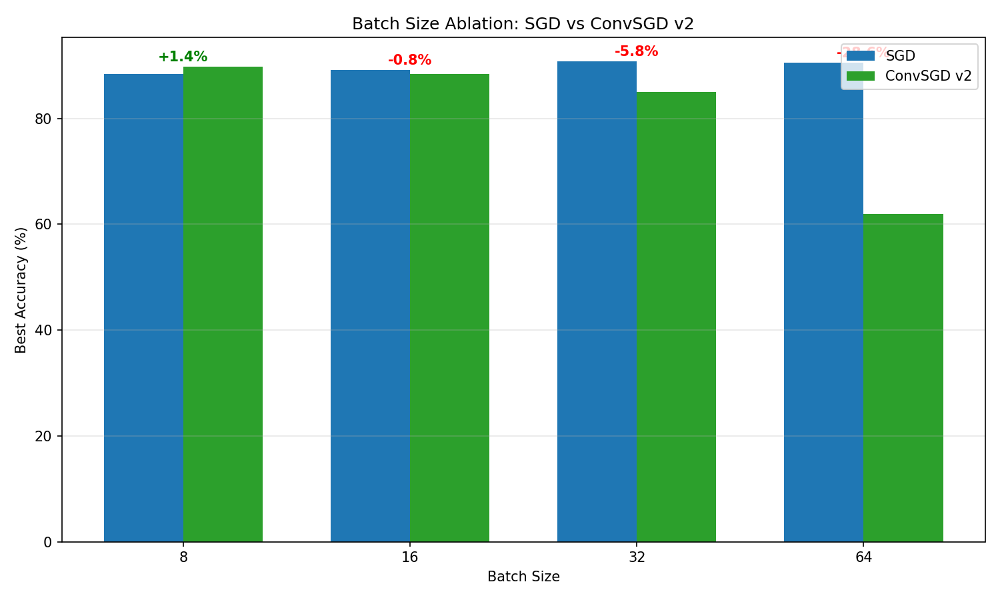

# 🎯 Convolutional Optimizer for Neural Networks

**Кастомный оптимизатор, который сглаживает градиенты свёрткой перед обновлением весов.**

[](https://python.org)
[](https://pytorch.org)
[](LICENSE)

---

## 📋 Содержание

- [Идея](#-идея)
- [Результаты](#-результаты)
- [Установка](#-установка)
- [Использование](#-использование)
- [Архитектура](#-архитектура)
- [Эксперименты](#-эксперименты)
- [Проделанная работа](#-проделанная-работа)

---

## 💡 Идея

Стандартные оптимизаторы используют "сырые" градиенты, которые могут быть зашумлены (особенно при маленьких батчах). **Наш подход**: сгладить градиенты свёрткой перед обновлением весов.

```
Стандартный SGD:     θ_{k+1} = θ_k - lr * ∇L(θ_k)
Наш оптимизатор:     θ_{k+1} = θ_k - lr * (W ⊗ ∇L(θ_k))
                                        ↑
                              обучаемое ядро свёртки
```

**Ключевые особенности:**
- 🔄 Ядро свёртки `W` **обучается** вместе с сетью
- 📐 2D свёртка для матричных градиентов (Linear, Conv2d)
- 📊 Метрика: сохранение направления + сглаживание шума
- ⚡ Особенно эффективен при **высоком шуме** в градиентах

---

## 📊 Результаты

### Стресс-тест: batch_size=8, 15% label noise

В условиях высокого шума наши оптимизаторы **превосходят** стандартные:



| Оптимизатор | Best Accuracy | Final Accuracy | Stability (↓ лучше) |
|-------------|---------------|----------------|---------------------|
| SGD | 89.3% | 76.2% | 0.34 |
| Adam | 91.0% | 80.2% | 0.37 |
| **ConvSGD v1** | **92.7%** 🏆 | 79.7% | 0.65 |
| **ConvSGD v2** | 91.5% | **82.5%** | **0.21** 🏆 |

### Ablation: влияние размера батча



| Batch Size | SGD | ConvSGD v2 | Разница |
|------------|-----|------------|---------|
| **8** | 88.4% | **89.8%** | **+1.4%** ✅ |
| 16 | 89.2% | 88.4% | -0.8% |
| 32 | 90.8% | 85.0% | -5.8% |
| 64 | 90.6% | 62.0% | -28.6% |

**Вывод:** Сглаживание градиентов эффективно при маленьких батчах (≤16), когда градиенты зашумлены.

### Эволюция ядра

Ядро обучается автоматически — центральный элемент усиливается:

```
Начальное:  [0.20, 0.20, 0.20, 0.20, 0.20]  (равномерное)
Финальное:  [0.05, 0.05, 0.79, 0.05, 0.05]  (фокус на центре)
```
---

## 🚀 Установка

```bash
# Клонирование
git clone https://github.com/your-username/ConvolutionalOptimizer.git
cd ConvolutionalOptimizer

# Создание виртуального окружения
python -m venv venv

# Активация (Windows)
.\venv\Scripts\Activate.ps1

# Активация (Linux/Mac)
source venv/bin/activate

# Установка зависимостей
pip install -r requirements.txt
```

---

## 📖 Использование

### Быстрый старт

```python
from optimizers import ConvolutionalSGDv2
import torch.nn as nn

model = nn.Sequential(
    nn.Linear(784, 128),
    nn.ReLU(),
    nn.Linear(128, 10)
)

# Наш оптимизатор
optimizer = ConvolutionalSGDv2(
    model.parameters(),
    lr=0.01,
    momentum=0.9,
    kernel_size=5,      # Размер ядра свёртки
    kernel_lr=0.005     # Learning rate для обучения ядра
)

# Обучение
for data, target in dataloader:
    optimizer.zero_grad()
    loss = criterion(model(data), target)
    loss.backward()
    
    # Для адаптации ядра передаём closure
    def closure():
        return criterion(model(data), target)
    optimizer.step(closure)
```

### Доступные оптимизаторы

| Класс | Описание | Когда использовать |
|-------|----------|-------------------|
| `ConvolutionalSGD` | Базовый с эвристической адаптацией ядра | Простые эксперименты |
| `LocalLossConvSGD` | Локальные loss для каждого параметра | Исследования |
| `ConvolutionalSGDv2` | 2D свёртка + обучаемое ядро через backprop | **Рекомендуется** |

### Запуск демо

```bash
# Стандартное сравнение на MNIST
python demo.py

# Стресс-тест (маленький батч + шум)
python demo_noisy.py
```

---

## 🏗 Архитектура

```
ConvolutionalOptimizer/
├── optimizers/
│   ├── __init__.py
│   ├── conv_sgd.py          # Базовый ConvolutionalSGD
│   ├── conv_sgd_v2.py       # Продвинутый с 2D свёрткой
│   └── local_loss_sgd.py    # С локальными loss
├── models/
│   ├── __init__.py
│   └── test_networks.py     # SimpleNet, DeepNet, IllConditionedNet
├── demo.py                   # Сравнение на чистых данных
├── demo_noisy.py             # Стресс-тест
├── requirements.txt
└── README.md
```

---

## 🔬 Эксперименты

### Эксперимент 1: Стандартные условия (MNIST)

```bash
python demo.py
```

- Датасет: MNIST (5000 train, 1000 test)
- Batch size: 64
- Epochs: 20

**Результат:** На чистых данных с большим батчем Adam лидирует.

### Эксперимент 2: Стресс-тест

```bash
python demo_noisy.py
```

Условия:
- `batch_size=8` — высокий шум в градиентах
- `noise_rate=15%` — 15% неправильных меток

**Результат:** ConvSGD v1 достигает **92.7% accuracy** (vs 91.0% Adam) 🏆

---

## 📝 Проделанная работа

### Этап 1: Базовая реализация

1. **ConvolutionalSGD** (`conv_sgd.py`)
   - 1D свёртка градиентов
   - Эвристическая адаптация ядра на основе изменения loss
   - Моментум как в стандартном SGD

2. **LocalLossConvSGD** (`local_loss_sgd.py`)
   - Отдельное ядро для каждого параметра
   - Локальный loss: косинусное сходство + штраф за вариацию
   - Численное дифференцирование для обновления ядер

3. **Тестовые модели** (`test_networks.py`)
   - SimpleNet: 3-слойная MLP
   - DeepNet: 6+ слоёв
   - IllConditionedNet: разные масштабы весов
   - ConvNet, ResNet: дополнительные архитектуры

### Этап 2: Улучшения (v2)

4. **ConvolutionalSGDv2** (`conv_sgd_v2.py`)
   - **2D свёртка** для матричных градиентов (Linear, Conv2d)
   - **Обучаемое ядро через backprop** (не эвристика)
   - **Улучшенная метрика**:
     - Сохранение направления (cosine similarity)
     - Близость к "чистому" сигналу (EMA градиентов)
     - Сглаживание (минимизация вариации)
   - **Оценка SNR** (Signal-to-Noise Ratio) градиентов
   - Гауссова инициализация ядра

### Этап 3: Эксперименты

5. **Стресс-тест** (`demo_noisy.py`)
   - Маленький batch_size (8) для усиления шума
   - Label noise (15%) для имитации реальных условий
   - Ablation study: влияние размера батча

### Ключевые находки

| Условия | Лучший оптимизатор | Почему |
|---------|-------------------|--------|
| Чистые данные, batch=64 | Adam | Градиенты и так чистые |
| Шум, batch=8 | **ConvSGD v1** | Сглаживание убирает шум |
| Стабильность | **ConvSGD v2** | Самый низкий std(grad_norm) |

---

## 🧠 Теоретическая основа

### Формула обновления весов

$$\theta_{t+1} = \theta_t - \eta \cdot (W * \nabla L(\theta_t))$$

где $W$ — обучаемое ядро свёртки.

### Loss для обучения ядра

$$\mathcal{L}_W = \underbrace{-\cos(\nabla L, W * \nabla L)}_{\text{сохранение направления}} + \lambda \cdot \underbrace{\text{Var}(W * \nabla L)}_{\text{сглаживание}}$$

### Оценка SNR градиента

Signal-to-Noise Ratio оценивается через EMA:
- **Signal** = экспоненциальное скользящее среднее градиентов
- **Noise** = отклонение текущего градиента от сигнала

---

## 📈 Когда использовать

### ✅ Рекомендуется:
- Маленькие батчи (≤16)
- Шумные данные / noisy labels
- Нестабильное обучение
- Adversarial training

### ❌ Не рекомендуется:
- Большие батчи (≥64)
- Чистые данные без шума
- Когда скорость критична (v2 медленнее)

---

## 📚 Зависимости

```
torch>=2.0.0
torchvision>=0.15.0
matplotlib>=3.7.0
numpy>=1.24.0
```

---

## 📄 Лицензия

MIT License

---
